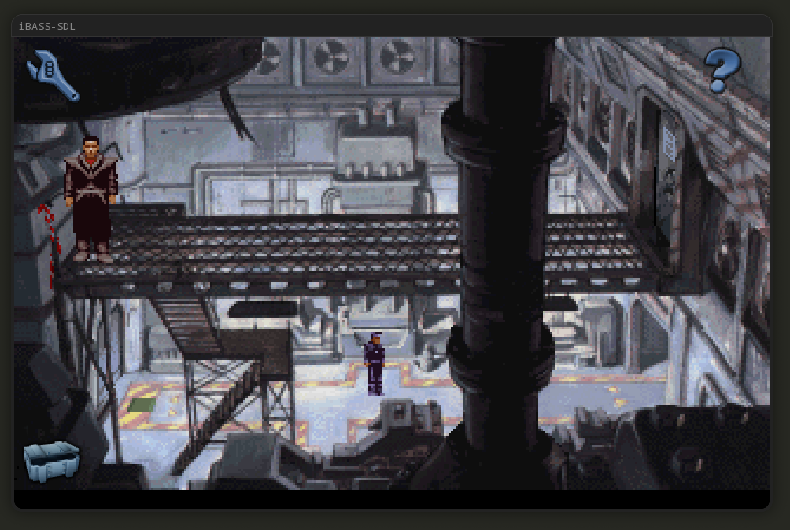
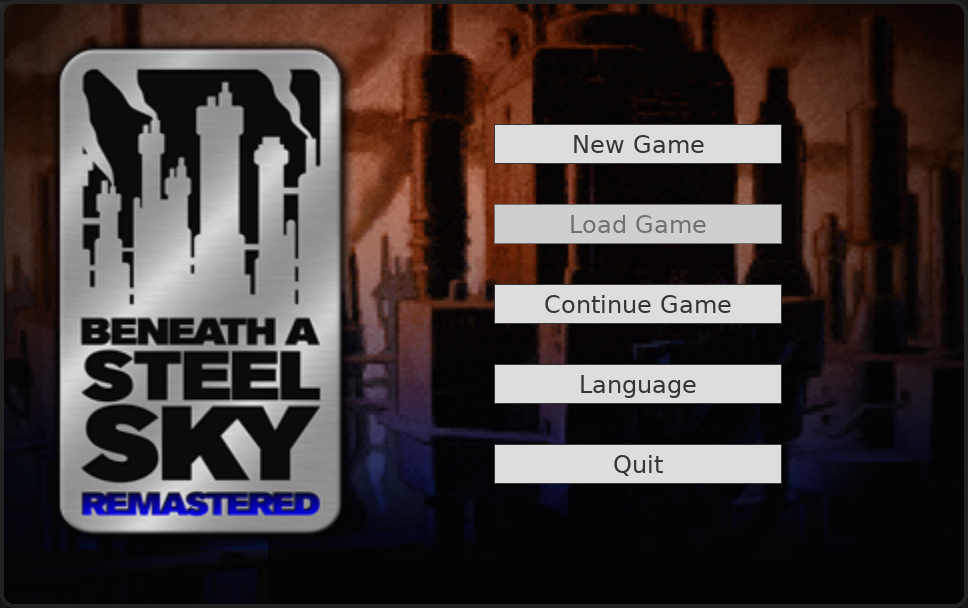
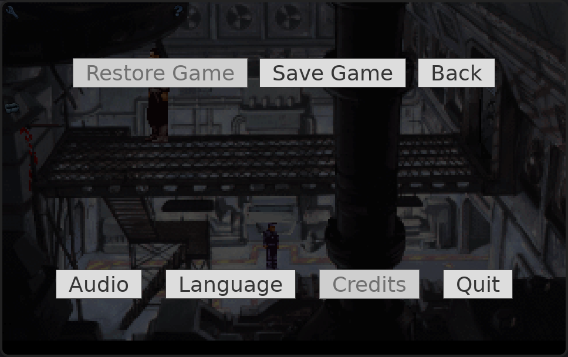
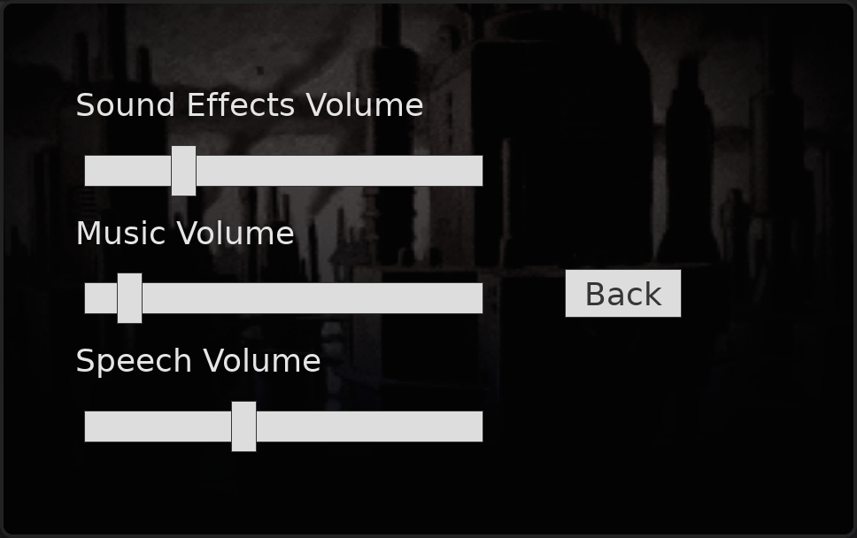

# iBASS-SDL
Beneath A Steel Sky: Remastered SDL port

The source code of their modified ScummVM engine and auxiliary files have been
provided in 2009 by Revolution Software.

This is based on their source, with an own "System" implementation based on
SDL2, without the sorrounding iOS app.

The GUI has been reimplemented with [TGUI](https://tgui.eu).

