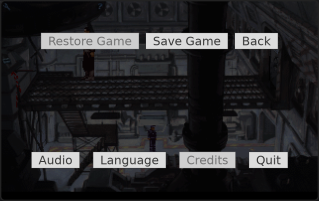
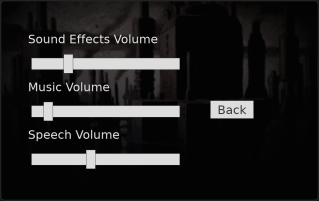

# iBASS-SDL

## Beneath A Steel Sky: Remastered SDL port

The source code of their modified ScummVM engine and auxiliary files have been
provided in 2009 by Revolution Software.

This is based on their source, with an own "System" implementation based on
SDL2, without the sorrounding iOS app.

The aim of this port is to adapt iBASS to newer ScummVM versions, fix bugs and
make it more portable (e.g. to run on other platforms like Android).

The GUI has been reimplemented with [TGUI](https://tgui.eu). For missing stuff
see [TODO.md](TODO.md).

Data files of the iOS version are currently needed. See [FILES.md](FILES.md) for
reference.

### Screenshots

### Building

CMake, version 3.22 or newer is needed and SDL2 version 2.0.18 or newer.
Furthermore SDL2_mixer and zlib.
These are provided by at least Ubuntu 22.04 LTS, which is the oldest CI target.

### License

In short: GPLv3 or later. See [COPYING.GPL3](COPYING.GPL3) for conditions.

The iBASS source has been released under GPLv2 or later, which was the license
of ScummVM at this time. See [COPYING.GPL2](COPYING.GPL2) for conditions.
However, ScummVM has changed it's license to GPLv3 or later in December 2021,
so this license applies to backports from recent versions.
Files added by this port (e.g. the GUI panels) and all changes are released by
the authors under GPLv3.
This combined work is now released under GPLv3 or later, which is possible:
<https://gnu.org/licenses/gpl-faq.html#v2v3Compatibility>.

#### External software

These are included in the executable:

* [cute_png](https://github.com/RandyGaul/cute_headers) - zlib or public domain
* [scope_guard](https://github.com/ricab/scope_guard) - public domain

These are additionally included when linking statically:

* [SDL2 and mixer](https://libsdl.org/) - zlib
* TGUI - zlib
